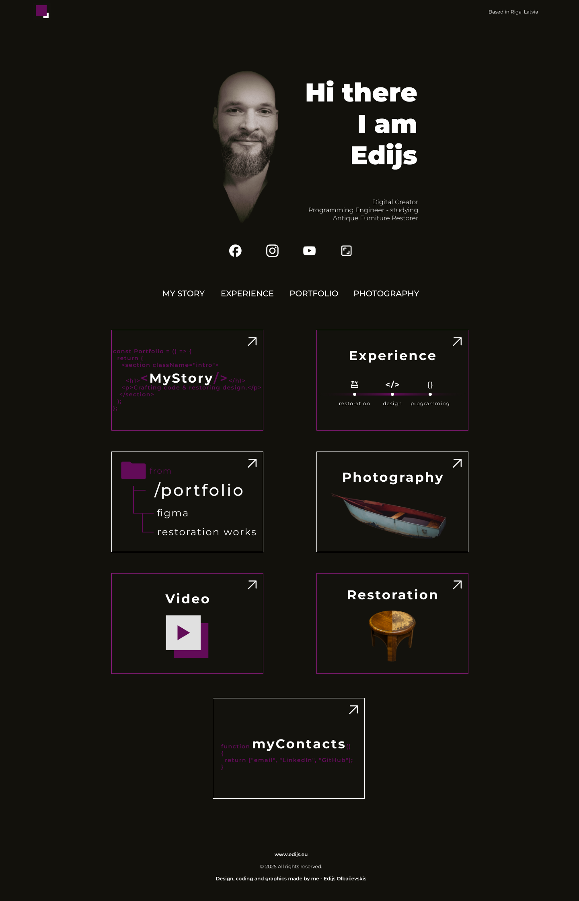
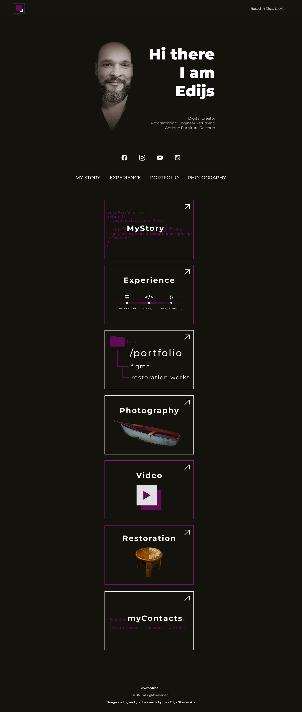
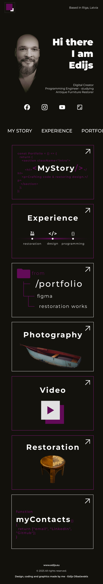

# UX/UI Design Prototypes

Concepts and layouts designed in Figma to demonstrate structure, usability, and aesthetics.  
Includes responsive versions for desktop, tablet, and mobile.

## 📐 Layouts
- **Desktop**  
- **Tablet**  
- **Mobile**   

## 🖼️ Screenshots

## 🔗 Live Figma Project
View full design here: [Figma Link](https://www.figma.com/design/Q5AQEmaq3tiarnd9Xk0xQi/M%C4%81jas-lapa?node-id=0-1&t=Zu08dp9r9nhI9n7W-1)

---      

**Author:** Edijs Olbačevskis  
**Website:** [edijs.eu](https://www.edijs.eu)
