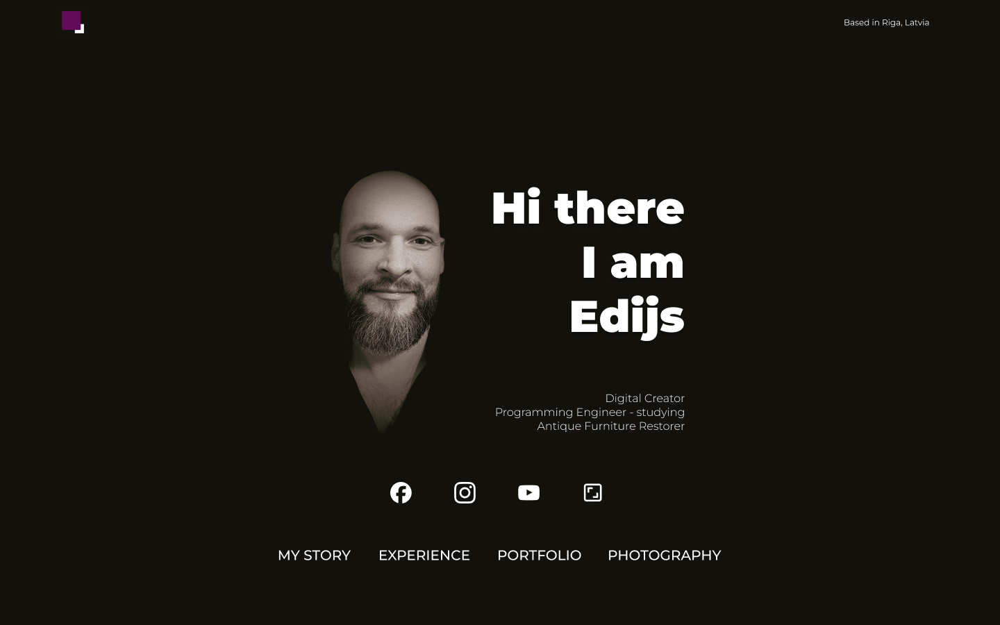
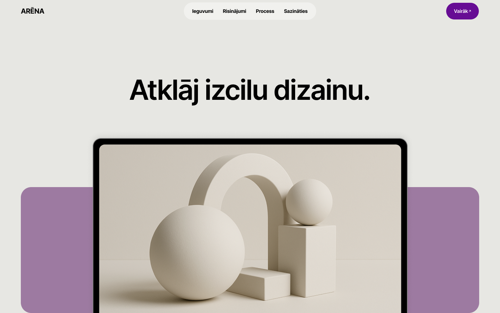
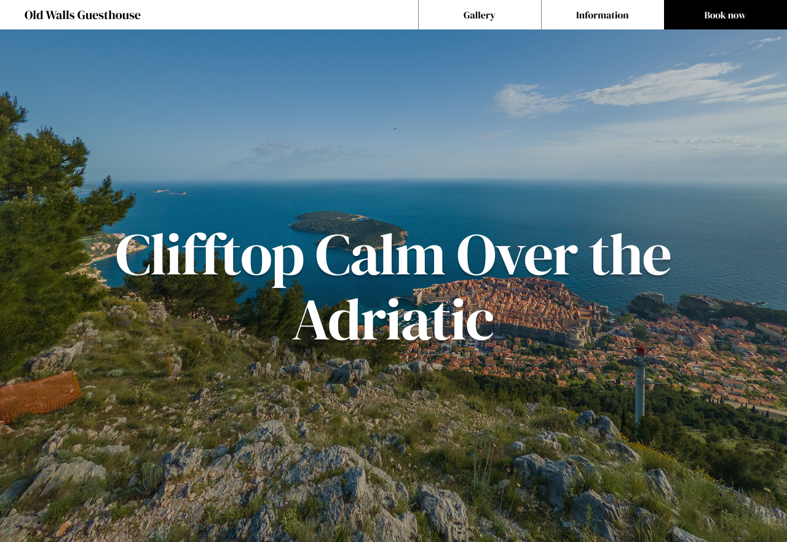
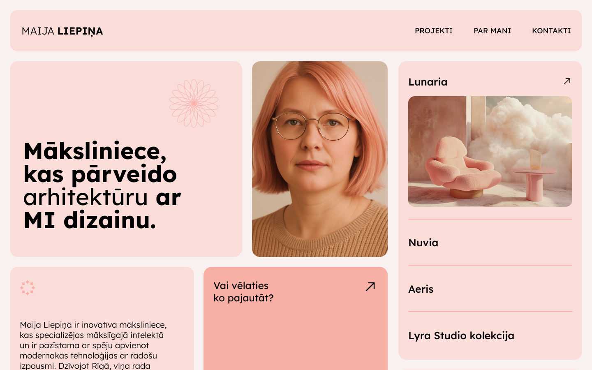
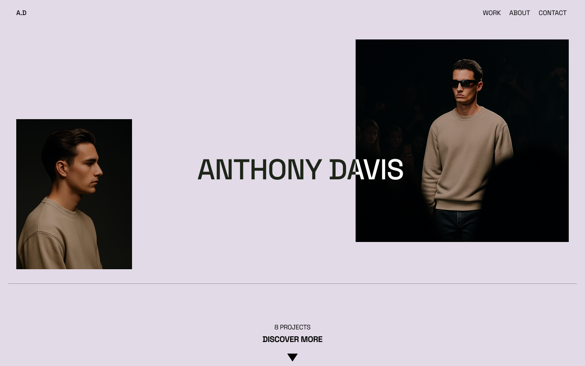

# UX/UI Design Prototypes

Concepts and layouts designed in Figma to demonstrate structure, usability, and aesthetics.  
Includes responsive versions for desktop, tablet, and mobile.

## 📐 Layouts
- **Desktop**  
- **Tablet**  
- **Mobile**   

## 🖼️ Screenshots

## 🔗 Live Figma Project
View full design here: [Figma Link](https://www.figma.com/design/zH7FKEp2ecc0pNdmq20ZAd/My_Portfolio?node-id=0-1&t=arRpsamAybZBAwaJ-1)

---      

**Author:** Edijs Olbačevskis  
**Website:** [edijs.eu](https://www.edijs.eu)
